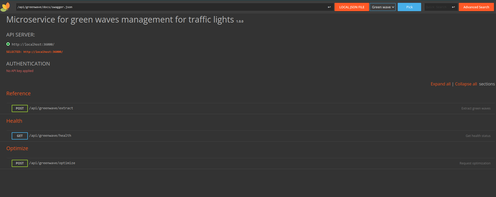

# Just a toy project to extract "green waves"

## About
This project is just a tool to see how "green waves" extraction works in traffic lights signal timing planning.

It includes calculation of best offset via genetic algorithm also.

Do not consider it to be any usable for production. It it just toy for understanding basics.

## Docker build
* Build docker image:
    ```bash
    docker build -t greenwave_api -f ./docker/Dockerfile .
    ```

* Run docker image with provided configuration file
    ```bash
    docker run -p 36000:36000 -v ./cmd/greenwave/conf.toml:/app/conf.toml greenwave_api --conf conf.toml
    ```

* Navigate to `http://localhost:36000/api/greenwave/docs/` and you are good to go.

    

## Docker pull
* Pull docker image
@tbd

* Run docker image
@tbd

## Swagger and REST API

* UI for [OpenAPI Spec Documentations](https://swagger.io/specification/) has been done via [rapidoc](https://rapidocweb.com/)

* JSON for Swagger has been prepared with [swaggo/swag](https://github.com/swaggo/swag).

* REST API part is written with usage of [labstack/echo](https://echo.labstack.com/).

* For logging [rs/zerolog](https://github.com/rs/zerolog) is used.

## Worth to mention

* [BurntSushi/toml](https://github.com/BurntSushi/toml) for TOML support
* [stretchr/testify](https://github.com/stretchr/testify) for testing tools