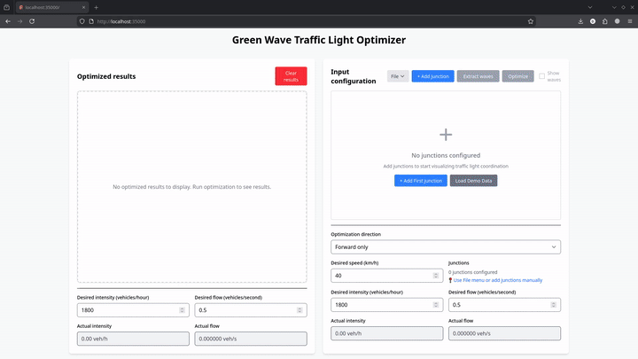
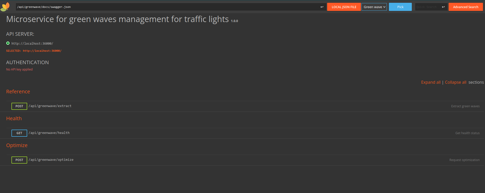

# Just a toy project to extract "green waves"

## About
This project is just a tool to see how "green waves" (see ref. https://en.wikipedia.org/wiki/Green_wave) extraction works in traffic lights signal timing planning.

It includes calculation of best offset via genetic algorithm also.

Do not consider it to be any usable for production. It it just toy for understanding basics.

It works (as for `30th Jan 2026`) with only single direction of the given road.
UPD (`31th Jan 2026`): now both directions are possible to try to optimize

## Docker

### Build
```bash
./docker.sh
```

### Run
```bash
docker run -p 36000:36000 greenwave
```

### Usage
* **Web UI**: http://localhost:36000
* **Swagger API docs**: http://localhost:36000/api/greenwave/docs/

#### Web UI Demo

Forward direction only |
:-------------------------:|
 |

Both directions |
:-------------------------:|
 |

__Note__: In second example only reverse direction got "green wave" through all junctions, therefore vehicles per hour for forward direction is zero. So intensity is calculated only for cases when there ARE "green waves" which pass through all junctions.

#### Swagger Documentation



### Custom configuration
```bash
docker run -p 35000:35000 \
    -e SERVER_HOST=0.0.0.0 \
    -e SERVER_PORT=35000 \
    -e SERVER_MAIN_PATH=api \
    -e SERVER_STARTUP_MESSAGE=true \
    -e USE_CORS=true \
    greenwave
```

Available environment variables:
| Variable | Default | Description |
|----------|---------|-------------|
| `SERVER_HOST` | `0.0.0.0` | Server bind address |
| `SERVER_PORT` | `36000` | Server port |
| `SERVER_MAIN_PATH` | `api` | API base path* |
| `SERVER_STARTUP_MESSAGE` | `true` | Show startup message |
| `USE_CORS` | `true` | Enable CORS |

\* `SERVER_MAIN_PATH`: Web UI uses hardcoded path `/api/greenwave`. Changing this variable requires rebuilding the UI.

* Examples of JSON data for requests for can be found in [the following README.md](./cmd/greenwave/README.md)

## Docker pull

### From GitHub сontainer registry
```bash
docker pull ghcr.io/lddl/greenwave:latest
docker run -p 36000:36000 ghcr.io/lddl/greenwave:latest
```

### From Dockerhub
```bash
docker pull dimahkiin/greenwave:latest
docker run -p 36000:36000 dimahkiin/greenwave:latest
```

## Swagger and REST API

* UI for [OpenAPI Spec Documentations](https://swagger.io/specification/) has been done via [rapidoc](https://rapidocweb.com/)

* JSON for Swagger has been prepared with [swaggo/swag](https://github.com/swaggo/swag).

* REST API part is written with usage of [labstack/echo](https://echo.labstack.com/).

* For logging [rs/zerolog](https://github.com/rs/zerolog) is used.

## Worth to mention

* [BurntSushi/toml](https://github.com/BurntSushi/toml) for TOML support
* [stretchr/testify](https://github.com/stretchr/testify) for testing tools
